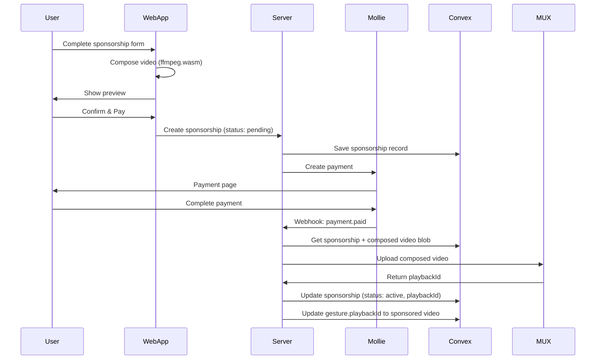

# Sponsorship Feature Documentation

## Overview

The Sponsorship feature allows external sponsors to pay for advertising placement within gesture video content. Sponsors can upload custom media (image + text overlay) that gets composited into gesture videos for a specified duration.

## Architecture

### Platform
- **Web-only** feature (not available in native apps)
- Public access for browsing, authentication required for payment
- Admin-style interface for managing sponsorship campaigns

### Tech Stack
- **Frontend**: React (TanStack Router)
- **Video Processing**: ffmpeg.wasm (client-side)
- **Backend**: Node.js server (apps/server)
- **Database**: Convex
- **File Storage**: Convex file storage
- **Video Hosting**: MUX
- **Payments**: Mollie API

---

## Database Schema

### Sponsorships Table

```typescript
sponsorships: defineTable({
  gestureId: v.id("gestures"),
  sponsorName: v.string(),
  sponsorEmail: v.string(),
  overlayImageStorageId: v.id("_storage"), // Convex storage ID
  overlayText: v.string(), // max 50 chars
  sponsoredVideoPlaybackId: v.optional(v.string()), // MUX playback ID (set after upload)
  originalVideoPlaybackId: v.string(), // backup of original gesture video
  startDate: v.number(), // timestamp
  endDate: v.number(), // timestamp
  durationWeeks: v.number(), // number of weeks sponsored
  status: v.string(), // "pending" | "active" | "expired" | "cancelled"
  molliePaymentId: v.optional(v.string()),
  paymentAmount: v.number(), // in cents (EUR)
  createdAt: v.number(),
  updatedAt: v.number(),
})
  .index("by_gesture", ["gestureId"])
  .index("by_status", ["status"])
  .index("by_gesture_and_status", ["gestureId", "status"])
  .index("by_end_date", ["endDate"])
```

### Gestures Table Updates

**No schema changes required** - The `playbackId` field will be dynamically swapped:
- When sponsorship is active: `playbackId` = sponsored video
- When sponsorship expires: `playbackId` = original video (restored)

---

## User Flow

### 1. Browse Gestures
```
/sponsors → List of all gestures with sponsorship status
```

For each gesture, show:
- Gesture name, category, preview
- Current sponsorship status:
  - ✅ **Available** - Can be sponsored
  - ⏰ **Sponsored until [date]** - Not available
- "Sponsor This Gesture" button (disabled if already sponsored)

### 2. Create Sponsorship Campaign

When user clicks "Sponsor This Gesture":

**Step 1: Upload Media**
- Upload image (JPEG/PNG, max 2MB, recommended 400x400px)
- Enter overlay text (max 50 characters)
- Select duration (dropdown: 1 week, 2 weeks, 4 weeks, 8 weeks, 12 weeks)

**Step 2: Preview**
- System downloads original gesture video from MUX
- Client-side video composition using ffmpeg.wasm
- Overlay image + text onto video
- Preview plays the composed video **before payment**
- Show calculated price: €[PRICE]/week × [WEEKS] = €[TOTAL]

**Step 3: Sponsor Information**
- Collect sponsor name and email
- Show terms & conditions

**Step 4: Payment**
- Authenticate user (WorkOS)
- Redirect to Mollie payment page
- After payment, webhook triggers video upload

### 3. Payment & Video Upload Flow



### 4. Sponsorship Expiration

**Scheduled Job** (runs daily):
```
1. Query sponsorships where endDate < now() AND status = "active"
2. For each expired sponsorship:
   a. Update sponsorship.status = "expired"
   b. Restore gesture.playbackId = sponsorship.originalVideoPlaybackId
   c. Delete sponsored video from MUX (optional, to save costs)
   d. Send expiration notification email (optional)
```

---

## Technical Implementation

### 1. Frontend Components

**File Structure:**
```
apps/web/src/
├── routes/
│   └── sponsors/
│       ├── index.tsx          # Gesture list page
│       └── $gestureId.tsx     # Sponsorship creation flow
├── components/
│   └── sponsors/
│       ├── GestureListItem.tsx
│       ├── SponsorshipForm.tsx
│       ├── VideoComposer.tsx  # ffmpeg.wasm wrapper
│       ├── VideoPreview.tsx
│       └── PaymentFlow.tsx
└── lib/
    └── video-composer.ts      # ffmpeg.wasm logic
```

#### Video Composition (ffmpeg.wasm)

**Overlay Positioning:**
```
┌─────────────────────────┐
│                         │
│   Gesture Video         │
│                         │
│   ┌─────────────────┐   │
│   │   [Image]       │   │ ← Bottom-right corner
│   │   "Text Here"   │   │   10% margin
│   └─────────────────┘   │
└─────────────────────────┘
```

**Implementation:**
```typescript
// lib/video-composer.ts
import { FFmpeg } from '@ffmpeg/ffmpeg';
import { fetchFile } from '@ffmpeg/util';

export async function composeVideoWithOverlay(
  videoUrl: string,
  imageFile: File,
  overlayText: string
): Promise<Blob> {
  const ffmpeg = new FFmpeg();
  await ffmpeg.load();

  // Load video and image
  await ffmpeg.writeFile('input.mp4', await fetchFile(videoUrl));
  await ffmpeg.writeFile('overlay.png', await fetchFile(imageFile));

  // Create text overlay filter
  const textFilter = `drawtext=text='${overlayText}':x=(w-tw-20):y=(h-th-20):fontsize=24:fontcolor=white:box=1:boxcolor=black@0.5:boxborderw=5`;
  
  // Create image overlay filter
  const imageFilter = `[0:v][1:v]overlay=W-w-20:H-h-80`;

  // Compose video
  await ffmpeg.exec([
    '-i', 'input.mp4',
    '-i', 'overlay.png',
    '-filter_complex', `${imageFilter},${textFilter}`,
    '-codec:a', 'copy',
    'output.mp4'
  ]);

  // Read output
  const data = await ffmpeg.readFile('output.mp4');
  return new Blob([data], { type: 'video/mp4' });
}
```

### 2. Backend API

**File Structure:**
```
apps/server/src/
├── routes/
│   └── sponsorships.ts        # API routes
├── services/
│   ├── mux.ts                 # MUX video upload
│   └── sponsorships.ts        # Business logic
└── webhooks/
    └── mollie.ts              # Payment webhook handler
```

#### MUX Integration

```typescript
// services/mux.ts
import Mux from '@mux/mux-node';

const mux = new Mux({
  tokenId: process.env.MUX_TOKEN_ID!,
  tokenSecret: process.env.MUX_TOKEN_SECRET!,
});

export async function uploadVideoToMux(
  videoUrl: string,
  gestureId: string
): Promise<string> {
  // Create MUX asset from URL
  const asset = await mux.video.assets.create({
    input: [{ url: videoUrl }],
    playback_policy: ['public'],
    mp4_support: 'standard',
    metadata: {
      gestureId,
      type: 'sponsored'
    }
  });

  // Wait for asset to be ready
  let assetStatus = asset;
  while (assetStatus.status !== 'ready') {
    await new Promise(resolve => setTimeout(resolve, 2000));
    assetStatus = await mux.video.assets.retrieve(asset.id);
  }

  return assetStatus.playback_ids![0].id;
}

export async function deleteVideoFromMux(playbackId: string): Promise<void> {
  // Find asset by playback ID and delete
  const assets = await mux.video.assets.list();
  const asset = assets.find(a => 
    a.playback_ids?.some(p => p.id === playbackId)
  );
  
  if (asset) {
    await mux.video.assets.delete(asset.id);
  }
}
```

#### Mollie Webhook Handler

```typescript
// webhooks/mollie.ts
import { mollieClient } from '@smog/auth';

export async function handleMollieWebhook(paymentId: string) {
  const payment = await mollieClient.payments.get(paymentId);

  if (payment.status === 'paid') {
    // 1. Get sponsorship from Convex by molliePaymentId
    const sponsorship = await getSponsorshipByPaymentId(paymentId);
    
    // 2. Get composed video blob from temporary storage
    const videoBlob = await getComposedVideo(sponsorship._id);
    
    // 3. Upload to publicly accessible URL first (temp storage)
    const videoUrl = await uploadToTempStorage(videoBlob);
    
    // 4. Upload to MUX
    const playbackId = await uploadVideoToMux(videoUrl, sponsorship.gestureId);
    
    // 5. Update sponsorship status and playbackId
    await updateSponsorship(sponsorship._id, {
      status: 'active',
      sponsoredVideoPlaybackId: playbackId,
      startDate: Date.now()
    });
    
    // 6. Update gesture to use sponsored video
    await updateGesturePlaybackId(sponsorship.gestureId, playbackId);
    
    // 7. Clean up temp storage
    await deleteTempVideo(videoUrl);
  }
}
```

### 3. Convex Functions

**File Structure:**
```
packages/convex/convex/
├── sponsorships.ts            # Queries & mutations
└── schema.ts                  # Updated schema
```

#### Key Functions

```typescript
// sponsorships.ts

// Create sponsorship (called from web app)
export const create = mutation({
  args: {
    gestureId: v.id("gestures"),
    sponsorName: v.string(),
    sponsorEmail: v.string(),
    overlayImageStorageId: v.id("_storage"),
    overlayText: v.string(),
    durationWeeks: v.number(),
    paymentAmount: v.number(),
  },
  handler: async (ctx, args) => {
    // Get gesture to backup original playbackId
    const gesture = await ctx.db.get(args.gestureId);
    
    // Check if gesture is already sponsored
    const existing = await ctx.db
      .query("sponsorships")
      .withIndex("by_gesture_and_status", q => 
        q.eq("gestureId", args.gestureId).eq("status", "active")
      )
      .first();
    
    if (existing) {
      throw new Error("Gesture is already sponsored");
    }
    
    // Create sponsorship
    const endDate = Date.now() + (args.durationWeeks * 7 * 24 * 60 * 60 * 1000);
    
    return await ctx.db.insert("sponsorships", {
      ...args,
      originalVideoPlaybackId: gesture!.playbackId,
      startDate: 0, // Set after payment
      endDate,
      status: "pending",
      createdAt: Date.now(),
      updatedAt: Date.now(),
    });
  },
});

// Get active sponsorship for gesture
export const getActiveByGesture = query({
  args: { gestureId: v.id("gestures") },
  handler: async (ctx, args) => {
    return await ctx.db
      .query("sponsorships")
      .withIndex("by_gesture_and_status", q =>
        q.eq("gestureId", args.gestureId).eq("status", "active")
      )
      .first();
  },
});

// List all gestures with sponsorship info
export const listGesturesWithSponsorship = query({
  args: {},
  handler: async (ctx) => {
    const gestures = await ctx.db
      .query("gestures")
      .withIndex("by_active", q => q.eq("isActive", true))
      .collect();
    
    const sponsorships = await ctx.db
      .query("sponsorships")
      .withIndex("by_status", q => q.eq("status", "active"))
      .collect();
    
    return gestures.map(gesture => {
      const sponsorship = sponsorships.find(s => s.gestureId === gesture._id);
      return {
        ...gesture,
        sponsorship: sponsorship || null,
      };
    });
  },
});

// Get expired sponsorships (for scheduled job)
export const getExpired = query({
  args: {},
  handler: async (ctx) => {
    const now = Date.now();
    return await ctx.db
      .query("sponsorships")
      .withIndex("by_status", q => q.eq("status", "active"))
      .filter(q => q.lt(q.field("endDate"), now))
      .collect();
  },
});

// Update gesture playback ID (called after payment or expiration)
export const updateGesturePlaybackId = mutation({
  args: {
    gestureId: v.id("gestures"),
    playbackId: v.string(),
  },
  handler: async (ctx, args) => {
    await ctx.db.patch(args.gestureId, {
      playbackId: args.playbackId,
      lastUpdated: Date.now(),
    });
  },
});
```

### 4. Scheduled Jobs

**Expiration Handler:**
```typescript
// Server cron job (runs daily at 00:00)
import cron from 'node-cron';

cron.schedule('0 0 * * *', async () => {
  console.log('Running sponsorship expiration job...');
  
  // Get expired sponsorships from Convex
  const expired = await getExpiredSponsorships();
  
  for (const sponsorship of expired) {
    try {
      // Restore original video
      await updateGesturePlaybackId(
        sponsorship.gestureId,
        sponsorship.originalVideoPlaybackId
      );
      
      // Mark as expired
      await updateSponsorshipStatus(sponsorship._id, 'expired');
      
      // Delete sponsored video from MUX (optional)
      if (sponsorship.sponsoredVideoPlaybackId) {
        await deleteVideoFromMux(sponsorship.sponsoredVideoPlaybackId);
      }
      
      // Send notification email (optional)
      // await sendExpirationEmail(sponsorship.sponsorEmail);
      
      console.log(`Expired sponsorship ${sponsorship._id}`);
    } catch (error) {
      console.error(`Error expiring sponsorship ${sponsorship._id}:`, error);
    }
  }
});
```

---

## Pricing Model

**Per-Week, Per-Gesture Pricing:**

```typescript
const PRICE_PER_WEEK_CENTS = 5000; // €50.00 per week

function calculatePrice(weeks: number): number {
  return PRICE_PER_WEEK_CENTS * weeks;
}

// Example prices:
// 1 week:   €50
// 2 weeks:  €100
// 4 weeks:  €200
// 8 weeks:  €400
// 12 weeks: €600
```

**Duration Options:**
- 1 week
- 2 weeks
- 4 weeks (1 month)
- 8 weeks (2 months)
- 12 weeks (3 months)

**Pricing shown in UI:**
```
€50/week × 4 weeks = €200 total
```

---

## UI/UX Considerations

### Gesture List Page (`/sponsors`)

```
┌────────────────────────────────────────────────────┐
│  Sponsor a Gesture                                 │
│  Choose a gesture to sponsor with your brand       │
├────────────────────────────────────────────────────┤
│                                                    │
│  ┌──────────────┐  ┌──────────────┐              │
│  │ [Video]      │  │ [Video]      │              │
│  │ Hello        │  │ Thank You    │              │
│  │ ✅ Available │  │ ⏰ Sponsored  │              │
│  │              │  │ until Jan 15  │              │
│  │ [Sponsor]    │  │ [Unavailable] │              │
│  └──────────────┘  └──────────────┘              │
│                                                    │
└────────────────────────────────────────────────────┘
```

### Sponsorship Creation Flow (`/sponsors/:gestureId`)

**Step-by-step wizard:**

1. **Upload Media**
   - Image uploader with preview
   - Text input (character counter: 0/50)
   - Duration selector

2. **Preview**
   - Loading state during video composition
   - Full video preview with overlays
   - Price breakdown

3. **Details**
   - Sponsor name input
   - Email input
   - Terms checkbox

4. **Payment**
   - Authentication required
   - Redirect to Mollie
   - Success/failure handling

---

## File Storage

**Using Convex File Storage:**

```typescript
// Upload sponsor image
const storageId = await ctx.storage.store(imageBlob);

// Get URL for image
const url = await ctx.storage.getUrl(storageId);

// Store composed video temporarily (until uploaded to MUX)
const videoStorageId = await ctx.storage.store(composedVideoBlob);

// Clean up after MUX upload
await ctx.storage.delete(videoStorageId);
```

---

## Security & Validation

### Input Validation

```typescript
// Overlay text
- Max 50 characters
- Sanitize HTML/special characters
- No profanity filter (optional)

// Image
- Max file size: 2MB
- Allowed formats: JPEG, PNG, WebP
- Recommended dimensions: 400x400px
- Validate aspect ratio (square preferred)

// Duration
- Allowed values: 1, 2, 4, 8, 12 weeks
- Validate against enum

// Email
- Valid email format
- Deliverable domain (optional)
```

### Access Control

```typescript
// Public access:
- GET /sponsors (list gestures)
- GET /sponsors/:id (view sponsorship form)

// Authenticated access:
- POST /sponsors (create sponsorship)
- POST /sponsors/payment (initiate payment)

// Admin access (future):
- GET /admin/sponsorships (manage all sponsorships)
- DELETE /admin/sponsorships/:id (cancel sponsorship)
```

### Payment Security

```typescript
// Mollie webhook verification
- Verify webhook signature
- Validate payment ID matches sponsorship
- Prevent double-processing
- Handle failed payments gracefully
```

---

## Error Handling

### User-Facing Errors

```typescript
// Gesture already sponsored
"This gesture is currently sponsored until [date]. Please choose another gesture or try again later."

// Payment failed
"Payment failed. Please try again or contact support."

// Video composition failed
"Failed to create preview video. Please check your image and try again."

// Invalid image
"Image must be less than 2MB and in JPEG or PNG format."

// Text too long
"Overlay text must be 50 characters or less."
```

### Technical Errors

```typescript
// MUX upload failed
- Retry logic (3 attempts)
- Refund payment if upload fails
- Notify admin

// Webhook processing failed
- Queue for retry
- Alert monitoring system
- Manual intervention required
```

---

## Testing Strategy

### Unit Tests
- Video composition logic
- Price calculation
- Validation functions
- Date/time calculations

### Integration Tests
- Convex mutations/queries
- MUX upload flow
- Mollie payment flow
- Webhook handling

### E2E Tests
- Complete sponsorship creation flow
- Payment success/failure scenarios
- Video preview functionality
- Expiration handling

---

## Monitoring & Analytics

### Metrics to Track

```typescript
// Business metrics
- Total sponsorships created
- Total revenue
- Average sponsorship duration
- Conversion rate (views → payments)

// Technical metrics
- Video composition success rate
- MUX upload success rate
- Payment webhook processing time
- Video playback errors

// User metrics
- Most sponsored gestures
- Sponsorship duration distribution
- Return sponsor rate
```

### Logging

```typescript
// Log important events
- Sponsorship created
- Payment initiated
- Payment succeeded/failed
- Video uploaded to MUX
- Sponsorship activated
- Sponsorship expired
- Errors at each step
```

---

## Future Enhancements

### Phase 2 Features
- Admin dashboard for managing sponsorships
- Email notifications (confirmation, expiration reminders)
- Sponsorship analytics dashboard for sponsors
- Volume discounts (e.g., 10% off for 3+ months)
- Multiple gestures package deals
- Scheduled sponsorships (start date in future)
- Sponsorship renewal automation

### Phase 3 Features
- A/B testing for overlay placement
- Video performance analytics
- Sponsor ROI tracking
- Custom overlay animations
- Mobile app support (view only)
- API for programmatic sponsorship management

---

## Migration & Rollout

### Initial Setup

1. **Database Migration**
   ```bash
   # Add sponsorships table to Convex schema
   # Deploy schema changes
   ```

2. **MUX Configuration**
   ```bash
   # Set MUX_TOKEN_ID and MUX_TOKEN_SECRET in server env
   # Test MUX upload with sample video
   ```

3. **Mollie Webhook Setup**
   ```bash
   # Configure webhook URL in Mollie dashboard
   # https://api.smog.app/webhooks/mollie
   # Test webhook with Mollie's test mode
   ```

4. **Frontend Deployment**
   ```bash
   # Add ffmpeg.wasm to web dependencies
   # Deploy /sponsors route
   # Test end-to-end flow in staging
   ```

### Launch Checklist

- [ ] Database schema deployed
- [ ] MUX credentials configured
- [ ] Mollie webhook configured and tested
- [ ] Pricing model finalized
- [ ] Terms & conditions written
- [ ] Email templates created (optional)
- [ ] Monitoring/alerting configured
- [ ] E2E tests passing
- [ ] Staging environment tested
- [ ] Production deployment
- [ ] Announce feature to potential sponsors

---

## Dependencies

### New NPM Packages

```json
// apps/web/package.json
{
  "@ffmpeg/ffmpeg": "^0.12.10",
  "@ffmpeg/util": "^0.12.1"
}

// apps/server/package.json
{
  "@mux/mux-node": "^8.0.0",
  "node-cron": "^3.0.3"
}
```

### Environment Variables

```bash
# apps/server/.env
MUX_TOKEN_ID=your_mux_token_id
MUX_TOKEN_SECRET=your_mux_token_secret
MOLLIE_API_KEY=your_mollie_api_key
```

---

## API Endpoints

### REST API (apps/server)

```
POST   /api/sponsorships              # Create sponsorship (returns payment URL)
GET    /api/sponsorships/:id          # Get sponsorship details
POST   /webhooks/mollie               # Mollie payment webhook
GET    /api/gestures/sponsorships     # List all gestures with sponsorship status
```

### Convex Functions

```typescript
// packages/convex/convex/sponsorships.ts

// Queries
export const listGesturesWithSponsorship = query(...)
export const getActiveByGesture = query(...)
export const getById = query(...)
export const getExpired = query(...)

// Mutations
export const create = mutation(...)
export const updateStatus = mutation(...)
export const updateGesturePlaybackId = mutation(...)
```

---

## Success Criteria

### MVP Launch Goals
- [ ] Sponsors can successfully complete payment flow
- [ ] Sponsored videos display correctly to all users
- [ ] Videos automatically expire and restore originals
- [ ] Zero payment processing errors
- [ ] <1% video composition failures
- [ ] <5 second video preview generation time

### Business Goals (First 3 Months)
- 10+ sponsored gestures
- €1000+ in sponsorship revenue
- 80%+ payment conversion rate
- <1% refund rate

---

## Support & Documentation

### User Documentation
- How to sponsor a gesture (step-by-step guide)
- Image requirements and best practices
- Pricing and duration options
- Payment and refund policies
- Preview and approval process

### Developer Documentation
- API documentation
- Webhook integration guide
- Video composition troubleshooting
- Database schema reference
- Deployment guide

---

## Contact & Support

For technical issues or sponsorship inquiries:
- Email: support@smog.app (create this)
- Documentation: https://smog.app/docs/sponsors (create this)
- Admin portal: https://smog.app/admin (future)

---

## Change Log

### v1.0.0 - Initial Release
- Basic sponsorship creation flow
- Client-side video composition
- Mollie payment integration
- MUX video upload
- Automatic expiration handling
- Web-only interface

### Future Versions
- v1.1.0: Email notifications
- v1.2.0: Admin dashboard
- v2.0.0: Native app support
