# Data model

The D1 (SQLite) schema of the whole product, defined with Drizzle in `packages/db/src/schema/*` and migrated by `packages/db/migrations/*`. The binding source is spec §5 ([docs/superpowers/specs/2026-09-29-cloudflare-rewrite-design.md](superpowers/specs/2026-09-29-cloudflare-rewrite-design.md#5-data-model-d1--drizzle)); this page is the reference for the tables as built.

## Conventions

- **Names:** snake_case in SQL, camelCase in TS (explicit column names, for example `emailVerified: integer("email_verified", …)`). Better Auth tables keep Better Auth's field names as TS keys, which its Drizzle adapter maps by.
- **Ids:** `text` primary keys from `newId()` (`crypto.randomUUID()`, `@smog/utils`); Better Auth tables use Better Auth's generator. Join tables have composite primary keys instead of ids.
- **Legacy ids:** `user`, `category`, `gesture` and `sponsorship` have `legacy_id` (unique, nullable), the Convex `_id`, for redirects and idempotent `INSERT … ON CONFLICT(legacy_id)` re-runs of the migration (spec §15). The other migrated rows get deterministic ids derived from their Convex ids, so their re-runs are idempotent on the primary key.
- **Timestamps:** integer epoch milliseconds in SQL, `Date` in TS (`integer({ mode: "timestamp_ms" })`, see DECISIONS). `created_at`/`updated_at` default to now in TS (`$defaultFn`; `updated_at` also `$onUpdate`); the service layer may set them explicitly. There are no SQL defaults for them. Nullable timestamps mark state: `published_at`, `revoked_at`, `used_at`, `paid_at`, … (no `is_active` booleans).
- **Booleans:** `integer({ mode: "boolean" })` (0/1).
- **Enums:** `text` columns with a `CHECK (col IN (…))` generated from the `const` arrays in `packages/db/src/enums.ts`. Adding a value is a schema change (`bun -F @smog/db db:generate`; SQLite rebuilds the table).
- **JSON:** `text({ mode: "json" })` (`audit_log.data`, `sponsorship_event.data`, `render_job.input`), always validated by a Zod schema at the service boundary.
- **Foreign keys:** every one has an explicit `ON DELETE` rule (below). Every FK column, and every column that the planned queries and crons (spec §8.1) filter or sort by, has an index. `gesture_fts.gesture_id` is the one exception (see the FTS notes). Uniqueness is enforced by the database.
- **Length limits** from the spec are `CHECK (length(col) BETWEEN …)` constraints as well as Zod rules.

## Diagram

Key columns are marked (PK, FK, UK = unique). The labels are the `ON DELETE` rules.

```mermaid
erDiagram
  user ||--o{ session : "cascade"
  user ||--o{ account : "cascade"
  user ||--o{ passkey : "cascade"
  user ||--o{ favorite : "cascade"
  user ||--o{ list : "owns (cascade)"
  user |o--o{ list_item : "added_by (set null)"
  user |o--o{ list_share : "created_by (set null)"
  user ||--o{ consent_event : "cascade"
  user |o--o{ audit_log : "actor (set null)"
  user |o--o{ sponsorship_event : "actor (set null)"
  gesture ||--o{ gesture_category : "cascade"
  category ||--o{ gesture_category : "cascade"
  gesture ||--o{ gesture_keyword : "cascade"
  gesture ||--o{ favorite : "cascade"
  gesture ||--o{ list_item : "cascade"
  gesture ||--o| gesture_fts : "indexed by (no FK)"
  list ||--o{ list_item : "cascade"
  list ||--o{ list_share : "cascade"
  sponsor ||--o| invoice_request : "cascade"
  sponsor ||--o{ sponsorship : "restrict"
  gesture ||--o{ sponsorship : "restrict"
  payment ||--o{ payment_item : "cascade"
  sponsorship ||--o{ payment_item : "restrict"
  sponsorship ||--o{ render_job : "cascade"
  sponsorship ||--o{ sponsorship_event : "cascade"
  sponsorship ||--o{ sponsorship_token : "cascade"
  user {
    text id PK
    text name
    text email UK
    integer email_verified
    text image
    integer created_at
    integer updated_at
    text role
    integer banned
    text ban_reason
    integer ban_expires
    text locale
    text legacy_id UK
    integer welcomed_at
  }
  session {
    text id PK
    integer expires_at
    text token UK
    integer created_at
    integer updated_at
    text ip_address
    text user_agent
    text user_id FK
    text impersonated_by
  }
  account {
    text id PK
    text account_id
    text provider_id
    text user_id FK
    text access_token
    text refresh_token
    text id_token
    integer access_token_expires_at
    integer refresh_token_expires_at
    text scope
    text password
    integer created_at
    integer updated_at
  }
  verification {
    text id PK
    text identifier
    text value
    integer expires_at
    integer created_at
    integer updated_at
  }
  passkey {
    text id PK
    text name
    text public_key
    text user_id FK
    text credential_id
    integer counter
    text device_type
    integer backed_up
    text transports
    integer created_at
    text aaguid
  }
  category {
    text id PK
    text slug UK
    text name
    integer sort_order
    integer published_at
    integer created_at
    integer updated_at
    text legacy_id UK
  }
  gesture {
    text id PK
    text slug UK
    text name
    text description
    text playback_id
    text mux_asset_id
    integer published_at
    integer created_at
    integer updated_at
    text legacy_id UK
  }
  gesture_category {
    text gesture_id PK,FK
    text category_id PK,FK
  }
  gesture_keyword {
    text gesture_id PK,FK
    text keyword PK
    integer position
  }
  favorite {
    text user_id PK,FK
    text gesture_id PK,FK
    integer created_at
  }
  list {
    text id PK
    text owner_id FK
    text name
    text description
    integer created_at
    integer updated_at
  }
  list_item {
    text list_id PK,FK
    text gesture_id PK,FK
    integer position
    text added_by FK
    integer created_at
  }
  list_share {
    text id PK
    text list_id FK
    text role
    text token UK
    text created_by FK
    integer created_at
    integer revoked_at
  }
  consent_event {
    text id PK
    text user_id FK
    text purpose
    integer granted
    text policy_version
    text source
    integer created_at
  }
  audit_log {
    text id PK
    text actor_id FK
    text action
    text target_type
    text target_id
    text data
    integer created_at
  }
  sponsor {
    text id PK
    text name
    text email
    text company
    text locale
    integer created_at
  }
  invoice_request {
    text sponsor_id PK,FK
    text name
    text vat_number
    text email
  }
  sponsorship {
    text id PK
    text sponsor_id FK
    text gesture_id FK
    text display_name
    text logo_key
    text status
    integer starts_at
    integer ends_at
    text video_playback_id
    text video_asset_id
    integer reminder_sent_at
    integer created_at
    integer updated_at
    text legacy_id UK
  }
  payment {
    text id PK
    text mollie_id UK
    text kind
    text status
    integer amount_cents
    text currency
    text checkout_url
    integer paid_at
    integer created_at
    integer updated_at
    integer refunded_cents
    integer refunded_at
    integer charged_back_cents
    integer charged_back_at
  }
  payment_item {
    text payment_id PK,FK
    text sponsorship_id PK,FK
    integer amount_cents
    integer includes_logo
  }
  render_job {
    text id PK
    text sponsorship_id FK
    text status
    text workflow_instance_id UK
    text input
    text mux_upload_id
    text mux_asset_id
    text playback_id
    text error
    integer attempt
    integer created_at
    integer updated_at
    integer finished_at
  }
  sponsorship_event {
    text id PK
    text sponsorship_id FK
    text type
    text actor_id FK
    text data
    integer created_at
  }
  sponsorship_token {
    text id PK
    text sponsorship_id FK
    text purpose
    text token_hash UK
    integer expires_at
    integer used_at
    integer created_at
  }
  gesture_fts {
    text gesture_id
    text name
    text keywords
    text categories
    text description
  }
```

## Foreign keys

| From | To | ON DELETE |
|---|---|---|
| `session.user_id`, `account.user_id`, `passkey.user_id` | `user` | CASCADE |
| `favorite.user_id`, `list.owner_id`, `consent_event.user_id` | `user` | CASCADE |
| `list_item.added_by`, `list_share.created_by`, `audit_log.actor_id`, `sponsorship_event.actor_id` | `user` | SET NULL |
| `gesture_category.gesture_id`, `gesture_keyword.gesture_id`, `favorite.gesture_id`, `list_item.gesture_id` | `gesture` | CASCADE |
| `gesture_category.category_id` | `category` | CASCADE |
| `list_item.list_id`, `list_share.list_id` | `list` | CASCADE |
| `invoice_request.sponsor_id` | `sponsor` | CASCADE |
| `sponsorship.sponsor_id` | `sponsor` | RESTRICT |
| `sponsorship.gesture_id` | `gesture` | RESTRICT (a sponsored gesture cannot be deleted; unpublish it) |
| `payment_item.payment_id` | `payment` | CASCADE |
| `payment_item.sponsorship_id` | `sponsorship` | RESTRICT |
| `render_job.sponsorship_id`, `sponsorship_event.sponsorship_id`, `sponsorship_token.sponsorship_id` | `sponsorship` | CASCADE |

`session.impersonated_by` (admin plugin) is a plain user id, not a foreign key, as Better Auth generates it. The auth tables were compared with `bunx auth@1.7.6 generate` (phase 2 Task 2): same columns, types and FKs; the differences are listed in DECISIONS ("Better Auth schema reconciled with its CLI"). Better Auth uses no secondary storage: sessions and verification values live only in D1, and every session read queries D1.

## Key constraints

- `favorite` PK `(user_id, gesture_id)`: one favorite per user and gesture.
- `list_item` PK `(list_id, gesture_id)`: a gesture is in a list at most once; `position` orders the items.
- `list_share_active_role_uq`: unique `(list_id, role) WHERE revoked_at IS NULL`, so a list has at most one active `view` and one active `edit` link. Revoking a link (setting `revoked_at`) frees the slot.
- `sponsorship_gesture_blocking_uq`: unique `(gesture_id) WHERE status IN (awaiting_payment, rendering, render_failed, in_review, changes_requested, live, expiring)` (`BLOCKING_SPONSORSHIP_STATUSES`). A gesture has at most one active or pending sponsorship; terminal ones (`rejected`, `cancelled`, `expired`) do not count.
- `payment.mollie_id` unique (nullable until the Mollie payment exists); `payment.currency` is always `EUR`; amounts are ≥ 0.
- `sponsorship_token.token_hash` unique; `list_share.token` unique.
- `sponsorship.display_name` is 1..35 characters (`DISPLAY_NAME_MAX`), `list.name` 1..80, `list.description` ≤ 280, `sponsor.name` 1..120, `sponsor.company` ≤ 120, emails ≤ 254, `invoice_request.name` ≤ 160.

## Row rules the services follow

- **Render jobs:** a job's Workflow instance id is its own `id` (`workflow_instance_id = id`, unique). Workflow instance ids cannot be reused, so a retry (automatic or the admin "retry render") inserts a **new** `render_job` row with `attempt` + 1; the old row stays as `failed`. The newest row per sponsorship (`render_job_sponsorship_created_idx`) is the current one.
- **Sponsorship tokens:** regenerating a re-edit or renewal link inserts a new token and sets `expires_at = now` on the sponsorship's older unused tokens of the same purpose (no `revoked_at` column). A token is valid when `used_at IS NULL AND expires_at > now`. The monthly cron deletes expired rows.
- **Audit targets:** `target_type`/`target_id` name what an action touched: a row (`gesture`, `category`, `user`, `sponsorship`, `payment`, `list` + its id), a KV setting (`setting` + its key, for `maintenance.enable`/`maintenance.disable`), or nothing specific (`system` + NULL, for `export.sponsorships_csv`). `category.reorder` targets the category that moved; a bulk reorder writes one row per category.

## Sponsorship state machine

Statuses (`SPONSORSHIP_STATUSES`): `awaiting_payment → rendering → in_review → live → expiring → expired`, plus `render_failed`, `changes_requested`, `rejected` and `cancelled`. The blocking statuses are listed above; `rejected`, `cancelled` and `expired` are terminal. Approval sets `starts_at = now` and `ends_at = now + 365 days`; the reminder cron moves `live → expiring` and sets `reminder_sent_at`; a paid renewal adds 365 days to `ends_at` and moves `expiring → live`. Every transition writes a `sponsorship_event` row (type from `SPONSORSHIP_EVENT_TYPES`) in the same D1 batch. The transition table is enforced by `@smog/sponsorships` (phase 6), not by the database; the database only guarantees valid status values and one blocking sponsorship per gesture. Full diagram and rules: spec [§5.5](superpowers/specs/2026-09-29-cloudflare-rewrite-design.md#55-sponsorship-state-machine-enforced-in-smogsponsorships).

## Decisions

- **Favorites are one model**, the `favorite` table. There is no "default favorites" list; the old default list and `user_favorites` are merged into `favorite` by the migration. Lists are only user collections.
- **The sponsored video is joined, not copied.** `gesture.playback_id` is always the original video. Public gesture queries join the gesture's `live`/`expiring` sponsorship and use its `video_playback_id` when set, so expiry needs no "restore the original video" step.
- **Tokens are stored hashed** where they grant access to someone else's data: `sponsorship_token.token_hash` is the SHA-256 (`sha256Hex`) of a `newToken()` value, which appears only in the link. List share tokens (`list_share.token`) are stored in plain text because the owner must be able to copy the link again; they are 256-bit random capabilities and can be revoked.
- **One payment, many sponsorships:** `payment_item` links a Mollie payment to each sponsorship it pays for, with the per-item price (`priceSponsorship()`), instead of copying the Mollie id onto every row.
- **No IP address or user agent** in `consent_event` (data minimisation); the log is append-only and the newest row per purpose is the current state.
- **`audit_log.actor_id` is SET NULL**, so the trail survives an admin deleting their account.
- **Guests never have rows.** Their favorites, lists and consent live on the device (`@smog/local-store`) until they sign up and import them.

## Columns

### Auth (Better Auth)
#### `user`

| Column | TS | Type | Null | Notes |
|---|---|---|---|---|
| `id` | `id` | text |  | PK |
| `name` | `name` | text |  |  |
| `email` | `email` | text |  | unique |
| `email_verified` | `emailVerified` | integer (0/1) → boolean |  | default false |
| `image` | `image` | text | yes |  |
| `created_at` | `createdAt` | integer (ms) → Date |  |  |
| `updated_at` | `updatedAt` | integer (ms) → Date |  |  |
| `role` | `role` | text |  | enum: `user`, `admin`; default "user" |
| `banned` | `banned` | integer (0/1) → boolean | yes | default false |
| `ban_reason` | `banReason` | text | yes |  |
| `ban_expires` | `banExpires` | integer (ms) → Date | yes |  |
| `locale` | `locale` | text | yes | enum: `nl`, `en`, `fr` |
| `legacy_id` | `legacyId` | text | yes | unique |
| `welcomed_at` | `welcomedAt` | integer (ms) → Date | yes | server-only (migration 0012): when the welcome email was claimed |

Indexes: `user_created_at_idx` (created_at).

CHECK: `user_role_check`, `user_locale_check`.

`welcomed_at` (migration 0012, phase 8 ruling 16): the welcome email is claimed once in D1. `welcome()` runs `UPDATE user SET welcomed_at = ? WHERE id = ? AND welcomed_at IS NULL RETURNING id` and enqueues only when a row comes back, so two concurrent verifications send one welcome; the claim keeps `updated_at`. It is not a Better Auth additional field (no client reads or sets it). The migration is `ADD COLUMN` plus the backfill `UPDATE user SET welcomed_at = updated_at WHERE email_verified = 1`: no table rebuild, so `user_keep_one_admin` survives, and it never writes `role`. Unverified accounts stay NULL. The Convex import sets it to the plan's `--now`, so a migrated user is never welcomed.

Trigger: `user_keep_one_admin` (migration 0007, hand-written): `BEFORE UPDATE OF role` aborts with `last_admin` when an admin is demoted and no other admin without a ban in force remains (ruling 7, atomic). Deleting the last admin is refused by `account.delete` in code; admins cannot delete admins.
#### `session`

| Column | TS | Type | Null | Notes |
|---|---|---|---|---|
| `id` | `id` | text |  | PK |
| `expires_at` | `expiresAt` | integer (ms) → Date |  |  |
| `token` | `token` | text |  | unique |
| `created_at` | `createdAt` | integer (ms) → Date |  |  |
| `updated_at` | `updatedAt` | integer (ms) → Date |  |  |
| `ip_address` | `ipAddress` | text | yes |  |
| `user_agent` | `userAgent` | text | yes |  |
| `user_id` | `userId` | text |  | → user.id ON DELETE CASCADE |
| `impersonated_by` | `impersonatedBy` | text | yes |  |

Indexes: `session_user_id_idx` (user_id); `session_expires_at_idx` (expires_at, migration 0008: the daily retention purge deletes expired sessions).
#### `account`

| Column | TS | Type | Null | Notes |
|---|---|---|---|---|
| `id` | `id` | text |  | PK |
| `account_id` | `accountId` | text |  |  |
| `provider_id` | `providerId` | text |  |  |
| `user_id` | `userId` | text |  | → user.id ON DELETE CASCADE |
| `access_token` | `accessToken` | text | yes |  |
| `refresh_token` | `refreshToken` | text | yes |  |
| `id_token` | `idToken` | text | yes |  |
| `access_token_expires_at` | `accessTokenExpiresAt` | integer (ms) → Date | yes |  |
| `refresh_token_expires_at` | `refreshTokenExpiresAt` | integer (ms) → Date | yes |  |
| `scope` | `scope` | text | yes |  |
| `password` | `password` | text | yes |  |
| `created_at` | `createdAt` | integer (ms) → Date |  |  |
| `updated_at` | `updatedAt` | integer (ms) → Date |  |  |

Indexes: `account_user_id_idx` (user_id); `account_provider_account_idx` (provider_id, account_id).
#### `verification`

| Column | TS | Type | Null | Notes |
|---|---|---|---|---|
| `id` | `id` | text |  | PK |
| `identifier` | `identifier` | text |  |  |
| `value` | `value` | text |  |  |
| `expires_at` | `expiresAt` | integer (ms) → Date |  |  |
| `created_at` | `createdAt` | integer (ms) → Date |  |  |
| `updated_at` | `updatedAt` | integer (ms) → Date |  |  |

Indexes: `verification_identifier_idx` (identifier); `verification_expires_at_idx` (expires_at, migration 0008: the daily retention purge).
#### `passkey`

| Column | TS | Type | Null | Notes |
|---|---|---|---|---|
| `id` | `id` | text |  | PK |
| `name` | `name` | text | yes |  |
| `public_key` | `publicKey` | text |  |  |
| `user_id` | `userId` | text |  | → user.id ON DELETE CASCADE |
| `credential_id` | `credentialID` | text |  |  |
| `counter` | `counter` | integer |  |  |
| `device_type` | `deviceType` | text |  |  |
| `backed_up` | `backedUp` | integer (0/1) → boolean |  |  |
| `transports` | `transports` | text | yes |  |
| `created_at` | `createdAt` | integer (ms) → Date | yes |  |
| `aaguid` | `aaguid` | text | yes |  |

Indexes: `passkey_user_id_idx` (user_id); `passkey_credential_id_idx` (credential_id).

### Learning
#### `category`

| Column | TS | Type | Null | Notes |
|---|---|---|---|---|
| `id` | `id` | text |  | PK |
| `slug` | `slug` | text |  | unique |
| `name` | `name` | text |  |  |
| `sort_order` | `sortOrder` | integer |  | default 0 |
| `published_at` | `publishedAt` | integer (ms) → Date | yes |  |
| `created_at` | `createdAt` | integer (ms) → Date |  |  |
| `updated_at` | `updatedAt` | integer (ms) → Date |  |  |
| `legacy_id` | `legacyId` | text | yes | unique |

Indexes: `category_published_sort_idx` (published_at, sort_order).
#### `gesture`

| Column | TS | Type | Null | Notes |
|---|---|---|---|---|
| `id` | `id` | text |  | PK |
| `slug` | `slug` | text |  | unique |
| `name` | `name` | text |  |  |
| `sort_name` | `sortName` | text |  | `gestureSortName(name)` (`normalizeText`), set by every writer; the catalogue order |
| `description` | `description` | text |  | default "" |
| `playback_id` | `playbackId` | text |  |  |
| `mux_asset_id` | `muxAssetId` | text | yes |  |
| `published_at` | `publishedAt` | integer (ms) → Date | yes |  |
| `created_at` | `createdAt` | integer (ms) → Date |  |  |
| `updated_at` | `updatedAt` | integer (ms) → Date |  |  |
| `legacy_id` | `legacyId` | text | yes | unique |

Indexes: `gesture_published_sort_name_idx` (sort_name, id) WHERE published_at IS NOT NULL (the public catalogue order and its keyset cursor, migration 0002); `gesture_mux_asset_id_idx` (mux_asset_id).
#### `gesture_category`

| Column | TS | Type | Null | Notes |
|---|---|---|---|---|
| `gesture_id` | `gestureId` | text |  | PK; → gesture.id ON DELETE CASCADE |
| `category_id` | `categoryId` | text |  | PK; → category.id ON DELETE CASCADE |

Indexes: `gesture_category_category_id_idx` (category_id).
#### `gesture_keyword`

| Column | TS | Type | Null | Notes |
|---|---|---|---|---|
| `gesture_id` | `gestureId` | text |  | PK; → gesture.id ON DELETE CASCADE |
| `keyword` | `keyword` | text |  | PK |
| `position` | `position` | integer |  |  |
#### `favorite`

| Column | TS | Type | Null | Notes |
|---|---|---|---|---|
| `user_id` | `userId` | text |  | PK; → user.id ON DELETE CASCADE |
| `gesture_id` | `gestureId` | text |  | PK; → gesture.id ON DELETE CASCADE |
| `created_at` | `createdAt` | integer (ms) → Date |  |  |

Indexes: `favorite_gesture_id_idx` (gesture_id), `favorite_user_created_idx` (user_id, created_at, gesture_id): a user's favorites newest first.
#### `list`

| Column | TS | Type | Null | Notes |
|---|---|---|---|---|
| `id` | `id` | text |  | PK |
| `owner_id` | `ownerId` | text |  | → user.id ON DELETE CASCADE |
| `name` | `name` | text |  |  |
| `description` | `description` | text | yes |  |
| `created_at` | `createdAt` | integer (ms) → Date |  |  |
| `updated_at` | `updatedAt` | integer (ms) → Date |  |  |

Indexes: `list_owner_updated_idx` (owner_id, updated_at).

CHECK: `list_name_length_check`, `list_description_length_check`.
#### `list_item`

| Column | TS | Type | Null | Notes |
|---|---|---|---|---|
| `list_id` | `listId` | text |  | PK; → list.id ON DELETE CASCADE |
| `gesture_id` | `gestureId` | text |  | PK; → gesture.id ON DELETE CASCADE |
| `position` | `position` | integer |  |  |
| `added_by` | `addedBy` | text | yes | → user.id ON DELETE SET NULL |
| `created_at` | `createdAt` | integer (ms) → Date |  |  |

Indexes: `list_item_list_position_idx` (list_id, position); `list_item_gesture_id_idx` (gesture_id); `list_item_added_by_idx` (added_by).
#### `list_share`

| Column | TS | Type | Null | Notes |
|---|---|---|---|---|
| `id` | `id` | text |  | PK |
| `list_id` | `listId` | text |  | → list.id ON DELETE CASCADE |
| `role` | `role` | text |  | enum: `view`, `edit` |
| `token` | `token` | text |  | unique |
| `created_by` | `createdBy` | text | yes | → user.id ON DELETE SET NULL |
| `created_at` | `createdAt` | integer (ms) → Date |  |  |
| `revoked_at` | `revokedAt` | integer (ms) → Date | yes |  |

Indexes: unique `list_share_active_role_uq` (list_id, role) WHERE …; `list_share_list_id_idx` (list_id); `list_share_created_by_idx` (created_by).

CHECK: `list_share_role_check`.
#### `gesture_fts` (FTS5 virtual table, migration `0001_gesture_fts.sql`)

| Column | Indexed | Contents |
|---|---|---|
| `gesture_id` | no (`UNINDEXED`) | `gesture.id` |
| `name` | yes | `gesture.name` |
| `keywords` | yes | the gesture's keywords, joined by spaces |
| `categories` | yes | the names of its categories, joined by spaces |
| `description` | yes | `gesture.description` |

`tokenize = 'unicode61 remove_diacritics 2'`, `prefix = '2 3'`. No triggers: the gestures service rewrites the row (`reindexGesture` / `reindexGestureStatements` in `@smog/gestures/server`) in the same D1 batch as every write to the gesture, its keywords or its categories. The row is defined once, in `src/fts.ts` (`rebuildGestureFtsSql`): `DELETE` + `INSERT … SELECT` from the tables, so it indexes the batch's own writes; only **published** category names are indexed, so (un)publishing or renaming a category reindexes its gestures. The dev seed renders the same statements. Search keeps the best 200 candidates by `bm25(gesture_fts, 0, 10, 5, 3, 1)`, then ranks them in TS (spec §7.1).

`gesture_id` is `UNINDEXED`, so `reindexGesture`'s `DELETE FROM gesture_fts WHERE gesture_id = ?` scans the FTS table. That is fine at the catalogue's size (a few thousand gestures). If it gets slow, phase 3 can key the rows by rowid instead (a stable integer per gesture, `DELETE … WHERE rowid = ?`).

`wrangler d1 export` does not support databases with virtual tables, so `gesture_fts` blocks exporting a remote D1 as-is. To export, drop `gesture_fts` in a copy (or use D1 Time Travel to restore instead of an export), export, then recreate it with migration `0001` and a full reindex.

### Account, consent, audit
#### `consent_event`

| Column | TS | Type | Null | Notes |
|---|---|---|---|---|
| `id` | `id` | text |  | PK |
| `user_id` | `userId` | text |  | → user.id ON DELETE CASCADE |
| `purpose` | `purpose` | text |  | enum: `analytics`, `marketing` |
| `granted` | `granted` | integer (0/1) → boolean |  |  |
| `policy_version` | `policyVersion` | text |  |  |
| `source` | `source` | text |  | enum: `web`, `mobile`, `import` |
| `created_at` | `createdAt` | integer (ms) → Date |  |  |

Indexes: `consent_event_user_purpose_created_idx` (user_id, purpose, created_at).

CHECK: `consent_event_purpose_check`, `consent_event_source_check`.
#### `audit_log`

| Column | TS | Type | Null | Notes |
|---|---|---|---|---|
| `id` | `id` | text |  | PK |
| `actor_id` | `actorId` | text | yes | → user.id ON DELETE SET NULL |
| `action` | `action` | text |  | enum `AUDIT_ACTIONS` (30 values, `src/enums.ts`) |
| `target_type` | `targetType` | text |  | enum `AUDIT_TARGET_TYPES`: `gesture`, `category`, `user`, `sponsorship`, `payment`, `list`, `setting`, `system` |
| `target_id` | `targetId` | text | yes | the target row's id; the setting key for `setting` (e.g. `maintenance`); NULL for `system` actions (e.g. `export.sponsorships_csv`) |
| `data` | `data` | text (JSON) |  |  |
| `created_at` | `createdAt` | integer (ms) → Date |  |  |

Indexes: `audit_log_created_at_idx` (created_at); `audit_log_target_idx` (target_type, target_id); `audit_log_action_created_idx` (action, created_at); `audit_log_actor_id_idx` (actor_id).

CHECK: `audit_log_action_check`, `audit_log_target_type_check`.

### Sponsorships
#### `sponsor`

| Column | TS | Type | Null | Notes |
|---|---|---|---|---|
| `id` | `id` | text |  | PK |
| `name` | `name` | text |  |  |
| `email` | `email` | text |  |  |
| `company` | `company` | text | yes |  |
| `locale` | `locale` | text |  | enum: `nl`, `en`, `fr` |
| `created_at` | `createdAt` | integer (ms) → Date |  |  |

Indexes: `sponsor_email_idx` (email); `sponsor_email_lower_idx` (lower(email)), migration 0010: the admin user panel finds an account's sponsors by it.

CHECK: `sponsor_name_length_check`, `sponsor_email_length_check`, `sponsor_company_length_check`, `sponsor_locale_check`.
#### `invoice_request`

| Column | TS | Type | Null | Notes |
|---|---|---|---|---|
| `sponsor_id` | `sponsorId` | text |  | PK; → sponsor.id ON DELETE CASCADE |
| `name` | `name` | text |  |  |
| `vat_number` | `vatNumber` | text |  |  |
| `email` | `email` | text |  |  |

CHECK: `invoice_request_name_length_check`, `invoice_request_email_length_check`.
#### `sponsorship`

| Column | TS | Type | Null | Notes |
|---|---|---|---|---|
| `id` | `id` | text |  | PK |
| `sponsor_id` | `sponsorId` | text |  | → sponsor.id ON DELETE RESTRICT |
| `gesture_id` | `gestureId` | text |  | → gesture.id ON DELETE RESTRICT |
| `display_name` | `displayName` | text |  |  |
| `logo_key` | `logoKey` | text | yes |  |
| `status` | `status` | text |  | enum `SPONSORSHIP_STATUSES` (10 values, `src/enums.ts`) |
| `starts_at` | `startsAt` | integer (ms) → Date | yes |  |
| `ends_at` | `endsAt` | integer (ms) → Date | yes |  |
| `video_playback_id` | `videoPlaybackId` | text | yes |  |
| `video_asset_id` | `videoAssetId` | text | yes |  |
| `reminder_sent_at` | `reminderSentAt` | integer (ms) → Date | yes |  |
| `created_at` | `createdAt` | integer (ms) → Date |  |  |
| `updated_at` | `updatedAt` | integer (ms) → Date |  |  |
| `legacy_id` | `legacyId` | text | yes | unique |

Indexes: unique `sponsorship_gesture_blocking_uq` (gesture_id) WHERE …; `sponsorship_gesture_status_idx` (gesture_id, status); `sponsorship_status_ends_at_idx` (status, ends_at); `sponsorship_sponsor_id_idx` (sponsor_id); `sponsorship_created_id_idx` (created_at, id), migration 0010: the admin list (newest first) and the CSV export (oldest first) seek it.

CHECK: `sponsorship_status_check`, `sponsorship_display_name_length_check`.
#### `payment`

| Column | TS | Type | Null | Notes |
|---|---|---|---|---|
| `id` | `id` | text |  | PK |
| `mollie_id` | `mollieId` | text | yes | unique |
| `kind` | `kind` | text |  | enum: `initial`, `renewal` |
| `status` | `status` | text |  | enum: `open`, `paid`, `failed`, `canceled`, `expired`, `refund_needed` |
| `amount_cents` | `amountCents` | integer |  |  |
| `currency` | `currency` | text |  | enum: `EUR`; default "EUR" |
| `checkout_url` | `checkoutUrl` | text | yes |  |
| `paid_at` | `paidAt` | integer (ms) → Date | yes |  |
| `created_at` | `createdAt` | integer (ms) → Date |  |  |
| `updated_at` | `updatedAt` | integer (ms) → Date |  |  |
| `refunded_cents` | `refundedCents` | integer |  | default 0; Mollie's `amountRefunded`, stored on every re-fetch (migration 0008) |
| `refunded_at` | `refundedAt` | integer (ms) → Date | yes | when a refund was first recorded (migration 0008) |
| `charged_back_cents` | `chargedBackCents` | integer |  | default 0; Mollie's `amountChargedBack`, stored on every re-fetch, a reversal (a lower amount) included (migration 0009; phase 6 fix wave) |
| `charged_back_at` | `chargedBackAt` | integer (ms) → Date | yes | when the stored chargeback amount last rose (migration 0009; the window of its admin email, phase 6 fix wave); a reversal leaves it |

Indexes: `payment_status_created_idx` (status, created_at).

Refunds are made by hand in the Mollie dashboard (phase 6 ruling 4); a `refund_needed` payment with `refunded_cents >= amount_cents` reads as "Refunded" in the admin. Migration 0008 added both columns with `ALTER TABLE … ADD COLUMN` (no rebuild: `payment` has RESTRICT and CASCADE children). Migration 0009 added the two chargeback columns the same way: a chargeback keeps the payment `paid`, writes a `refund_needed` event (`reason: "chargeback"`) on each item and emails the admins (within 6 days of the rise); the sponsorship is not cancelled automatically. A reversed chargeback (Mollie lowers `amountChargedBack`) lowers `charged_back_cents` with no event, logged `[sponsorships] Chargeback on payment … reversed`. A payment Mollie reports `paid` while ours is still `open` (or cancelled), but whose `amountRefunded + amountChargedBack` already covers the amount, is not applied: it becomes `refund_needed` (`reason: "mismatch"`) and its items are released.

CHECK: `payment_kind_check`, `payment_status_check`, `payment_currency_check`, `payment_amount_check`.
#### `payment_item`

| Column | TS | Type | Null | Notes |
|---|---|---|---|---|
| `payment_id` | `paymentId` | text |  | PK; → payment.id ON DELETE CASCADE |
| `sponsorship_id` | `sponsorshipId` | text |  | PK; → sponsorship.id ON DELETE RESTRICT |
| `amount_cents` | `amountCents` | integer |  |  |
| `includes_logo` | `includesLogo` | integer (0/1) → boolean |  |  |

Indexes: `payment_item_sponsorship_id_idx` (sponsorship_id).

CHECK: `payment_item_amount_check`.
#### `render_job`

| Column | TS | Type | Null | Notes |
|---|---|---|---|---|
| `id` | `id` | text |  | PK |
| `sponsorship_id` | `sponsorshipId` | text |  | → sponsorship.id ON DELETE CASCADE |
| `status` | `status` | text |  | enum: `queued`, `running`, `succeeded`, `failed` |
| `workflow_instance_id` | `workflowInstanceId` | text |  | unique; equals `id` (see the render job notes) |
| `input` | `input` | text (JSON) |  |  |
| `mux_upload_id` | `muxUploadId` | text | yes |  |
| `mux_asset_id` | `muxAssetId` | text | yes |  |
| `playback_id` | `playbackId` | text | yes |  |
| `error` | `error` | text | yes |  |
| `attempt` | `attempt` | integer |  | default 1 |
| `created_at` | `createdAt` | integer (ms) → Date |  |  |
| `updated_at` | `updatedAt` | integer (ms) → Date |  |  |
| `finished_at` | `finishedAt` | integer (ms) → Date | yes |  |

Indexes: `render_job_sponsorship_created_idx` (sponsorship_id, created_at); `render_job_mux_upload_id_idx` (mux_upload_id); `render_job_mux_asset_id_idx` (mux_asset_id); `render_job_status_updated_idx` (status, updated_at), migration 0011: the render watchdog (phase 7 ruling 12) reads the `queued` and the `running` jobs oldest first, each status a seek with no sort.

CHECK: `render_job_status_check`, `render_job_attempt_check`.
#### `sponsorship_event`

| Column | TS | Type | Null | Notes |
|---|---|---|---|---|
| `id` | `id` | text |  | PK |
| `sponsorship_id` | `sponsorshipId` | text |  | → sponsorship.id ON DELETE CASCADE |
| `type` | `type` | text |  | enum `SPONSORSHIP_EVENT_TYPES` (21 values, `src/enums.ts`) |
| `actor_id` | `actorId` | text | yes | → user.id ON DELETE SET NULL |
| `data` | `data` | text (JSON) |  |  |
| `created_at` | `createdAt` | integer (ms) → Date |  |  |

Indexes: `sponsorship_event_sponsorship_created_idx` (sponsorship_id, created_at); `sponsorship_event_actor_id_idx` (actor_id).

CHECK: `sponsorship_event_type_check`.
#### `sponsorship_token`

| Column | TS | Type | Null | Notes |
|---|---|---|---|---|
| `id` | `id` | text |  | PK |
| `sponsorship_id` | `sponsorshipId` | text |  | → sponsorship.id ON DELETE CASCADE |
| `purpose` | `purpose` | text |  | enum: `reedit`, `renewal` |
| `token_hash` | `tokenHash` | text |  | unique |
| `expires_at` | `expiresAt` | integer (ms) → Date |  |  |
| `used_at` | `usedAt` | integer (ms) → Date | yes |  |
| `created_at` | `createdAt` | integer (ms) → Date |  |  |

Indexes: `sponsorship_token_expires_at_idx` (expires_at, for the monthly clean-up of expired tokens); `sponsorship_token_sponsorship_purpose_idx` (sponsorship_id, purpose).

CHECK: `sponsorship_token_purpose_check`.

## Relations

`src/schema/relations.ts` declares Drizzle `relations()` for every foreign key (both directions), so `db.query.<table>.findMany({ with: … })` works, and so does Better Auth's adapter when its joins are enabled. They add no SQL.

## Migrations, seed and tests

**Migrations are append-only.** `0000`–`0012` are merged (the next free number is `0013`); never edit or regenerate an existing migration, add a new one (a later deploy applies only the files it has not seen, so an edited file is silently skipped on every D1 that already ran it).

- **Retention** (phase 6 ruling 9, `packages/db/src/retention.ts`): the daily `15 3 * * *` cron deletes `audit_log` rows older than 3 × 365 days, expired `session` and `verification` rows, and `sponsorship_token` rows used or expired more than 29 days ago (so a daily run removes them within 30 days), in chunks of 500 (`rowid IN (SELECT rowid … LIMIT 500)`, at most 20 per purge per run). Each chunk read seeks an index except the used-token one (`used_at` has no index; the table is small). The same run (`runRetentionPurge`, `@smog/sponsorships/server`) clears `sponsorship.logo_key` on sponsorships that ended (`rejected`, `cancelled`, `expired`) more than 30 days ago and can no longer use the logo (`payment_item.includes_logo` keeps the fact), and deletes R2 `logos/*` objects that no sponsorship references and that were uploaded more than 24 h ago (a KV cursor resumes the listing across runs). `bun run retention --env <env> --dry-run` counts what it would delete.
- `bun -F @smog/db db:generate` runs `drizzle-kit generate` (generate only; wrangler applies migrations). Hand-written SQL (such as the FTS table) goes in a file made with `drizzle-kit generate --custom --name <name>`, so the drizzle journal stays in step.
- `bun -F @smog/db migrate:dev` applies them to the local dev D1 (`wrangler d1 migrations apply DB --env dev --local`, from `apps/site`; `migrations_dir` is `../../packages/db/migrations` in every env). `deploy.yml` applies them remotely before each deploy.
- `bun -F @smog/db seed:dev` regenerates `seed/dev.sql` (`scripts/seed.ts`), applies it locally and bumps the local `catalog:version` KV key (so a running dev server drops its typo-tier projection): 5 categories, 20 published gestures (sample Mux playback id, keywords, FTS rows rebuilt by `rebuildGestureFtsSql`, the statements `reindexGesture` runs) and the admin user `admin@smog.test` with the **dev-only** password `smog-dev-admin` (a Better Auth scrypt credential with a fixed salt; the seed replaces any other credential of that user). The admin row upserts on `email`, so an account that already signed up with that address keeps its id and is promoted to `admin`. Ids and timestamps are fixed and every statement is an upsert, so it can be re-run.
- Tests that need D1 use `@cloudflare/vitest-plugin`: the vitest config passes `readD1Migrations()` as the `TEST_MIGRATIONS` binding and lists `@smog/db/testing/apply-migrations` in `setupFiles`; `@smog/db/testing` has `createTestDb(env)` and the `makeUser` / `makeCategory` / `makeGesture` factories. See `packages/db/vitest.config.ts`.
